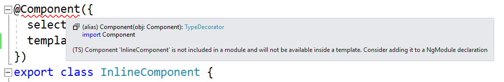

# Angular 2 in Visual Studio Sample Project

### Introduction

This repo is a sample project that shows off Angular 2 Language Service support in Visual Studio.

### Usage

**Prerequisite:** Visual Studio 2017 Update 5 or later

To use this project:
 * `git clone https://github.com/Microsoft/angular2-in-visual-studio.git`
 * `cd angular2-in-visual-studio`
 * `npm install`
 * In Visual Studio, "Open Folder" (Ctrl-Alt-Shift-O or File -> Open -> Folder...)
 * Select the cloned directory (*not* `src`)

# Tour

Once the project is opened, you can observe these new behaviors

### Semantic Warnings

Open `src\app\app.component.ts`. The Angular2 language service warns you that the `InlineComponent` class doesn't belong to a module:

### Inline Templates

### .ngml Files

### Errors

### Completions

### Navigation

