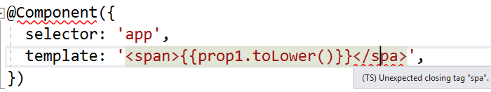
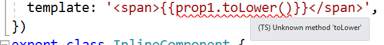
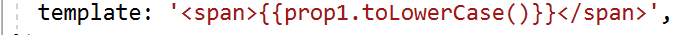
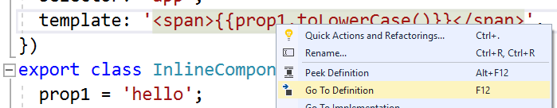
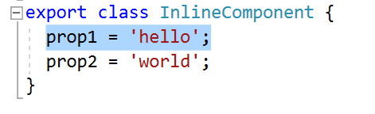
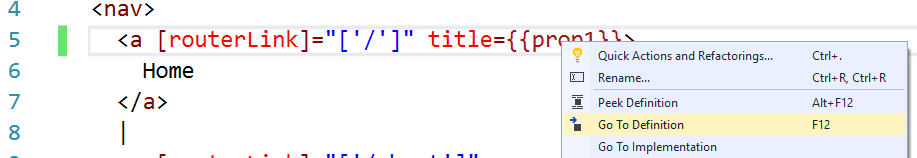
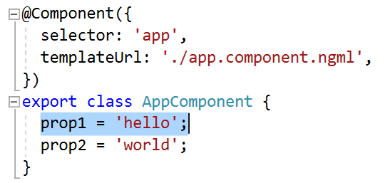
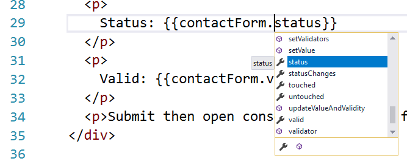
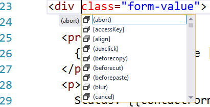

# Angular 2 in Visual Studio Sample Project

### Introduction

This repo is a sample project that shows off Angular 2 Language Service support in Visual Studio.

### Usage

**Prerequisite:** Visual Studio 2017 Update 5 or later

To use this project:
 * `git clone https://github.com/Microsoft/angular2-in-visual-studio.git`
 * `cd angular2-in-visual-studio`
 * `npm install`
 * In Visual Studio, "Open Folder" (Ctrl-Alt-Shift-O or File -> Open -> Folder...)
 * Select the cloned directory (*not* `src`)

# Tour

Once the project is opened, you can observe these new behaviors

### Semantic Warnings

Open `src\app\app.component.ts`. The Angular2 language service warns you that the `InlineComponent` class doesn't belong to a module:

### Errors in Inline Templates

Still in `src\app\app.component.ts`, you can try editing the inline template in `InlineComponent`. The project includes a syntax error:

Fix the syntax error by changing `</spa>` to ``. You'll now see a semantic error:

Angular2 identified another mistake here - there is no method named `toLower`; fix this to `toLowerCase`. The error disappears:

### Navigation

Now that we've fixed the errors, let's try some navigation. Place the caret on `prop1` in the inline template. Open the context menu and select "Go to Definition":

This will take us to the definition of `prop1` in the corresponding component:

### .ngml Files

Open `src\app\app.component.ngml`. This is the template file for the corresponding class `AppComponent` in `app.component.ts`.
On line 5, place the caret on `prop1` and invoke "Go to Definition" again:

This navigates us to the `prop1` declaration in `app.component.ts`. Note that even though the file had two classes, both with properties named `prop1`, we were properly navigated to the correct one:

### Completions

In both inline templates and ngml files, we'll get completion lists.

Open `src\app\contact\contact.component.ngml`. Go to line 29 and place the caret to the right of `.` in `contactForm.status`, and press `Ctrl-Space` to open the completion list:

Visual Studio will display all the members of the `contactForm`. You can also see completions in NGML template positions. Place the caret on line `23` after `div`, and press `Ctrl-Space` to open the completion list:

Now you'll see a list of the allowed attribute names, including those specific to Angular 2's template syntax, in the completion list.
